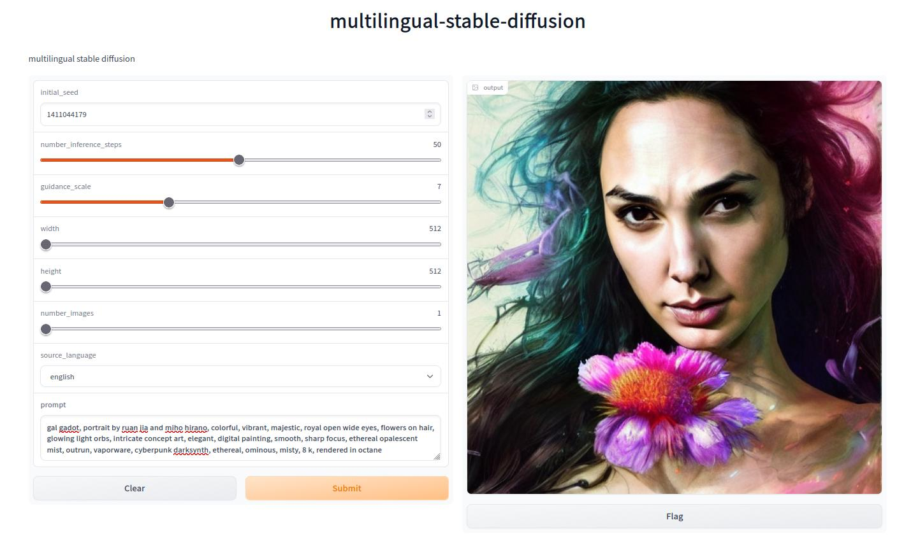

# multilingual-stable-diffusion
stable diffusion docker image 

<p align="center"> 
  
  <h3 align="center">
    gal gadot, portrait by ruan jia and miho hirano, colorful, vibrant, majestic
  </h3>  
</p>


# docker env variables 
* CACHE 
    * model will be cached here 
    * the model is huge so it is important to save it 
* TRANSFORMERS_CACHE

# initialization 
* create a cache dir 
* mount this dir to the docker system with -v path2cache:/home/solver/cache

```bash
    mkdir cache 
    mkdir cache/transformers
    # use -v path2cache:/home/solver/cache in docker run command  
```

# build and run server-mode for cpu 
```bash
docker build -t stable-diffusion:0.0 -f Dockerfile.gpu .
docker run --rm --name stable-diffusion --interactive --tty --gpus all -v path2cache:/home/solver/cache -p hostport:display_port stable-diffusion:0.0 --display_port 7068 --language_source 'french' --token your-token
``` 

# examples of prompts 
```
    seed = 4276421838
    guidance_sclace = 7
    width, height = 512, 512
    prompt = gal gadot, a colorful and vibrant majestic white queen open wide eyes drops a tear with flowers on her hair, glowing light orbs, intricate concept art, elegant, digital painting, smooth, sharp focus, ethereal opalescent mist, outrun, vaporware, cyberpunk darksynth, ethereal, ominous, misty, 8 k, by ruan jia and miho hirano, 8 k, rendered in octane 
```

